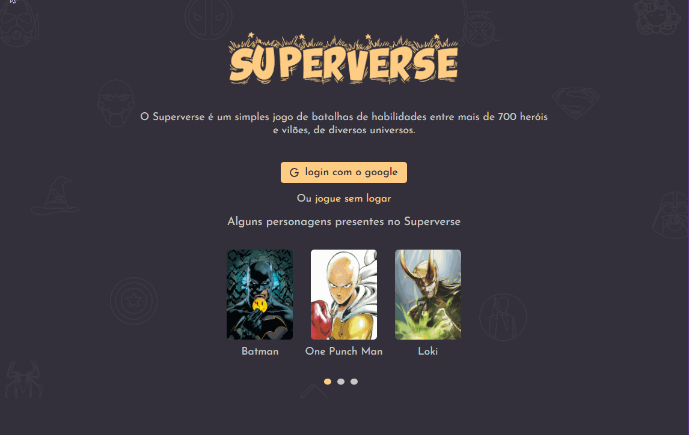
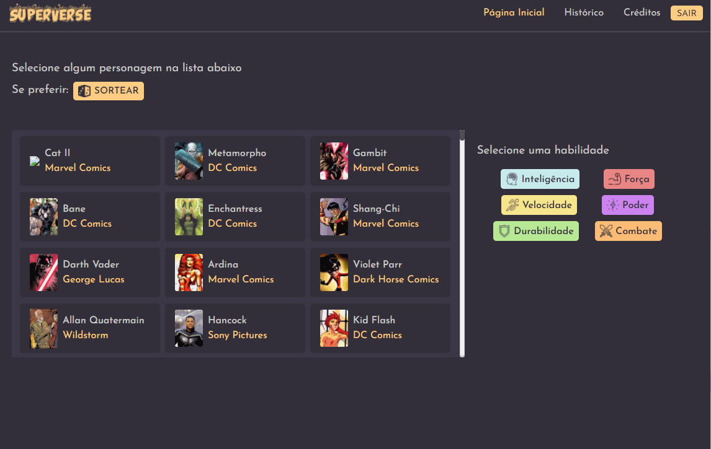

<h1 align="center">Superverse</h1>

- [Sobre 📖](#sobre-)
- [Layout 🎨](#layout-)
- [Diagramas 📁](#diagramas-)

<h2>Sobre 📖</h2>

Superverse é um jogo de cartas que compara a habilidades de personagens e cria históricos de batalhas. 
Ele consome duas API's, sendo uma API própria e a outra de terceiros. A nossa API 
(<a href="https://www.superheroapi.com/" target="_blank">Superverse API</a>) guarda o registro de batalhas,
enquanto a API de terceiros (<a href="https://github.com/Begin-org/superverse_api" target="_blank">Super Hero API</a>) retorna
as informações necessárias dos personagens.

<h2>Layout 🎨</h2>

<h2>Diagramas 📁</h2>

